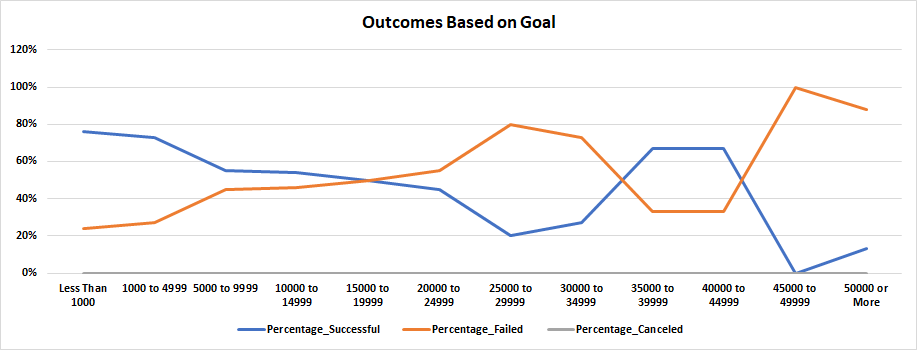

# Kickstarting with Excel

## Overview of Project

### Purpose
The purpose of this project was to analyze and visualize data provided by the excel spreadsheet data-1-1-3-Starterbook, renamed [Kickstarter_Challenge](https://github.com/stwpf01/Excel/blob/main/Kickstarter_Challenge.xlsx) for this project. Specifically, it was to analyze and visualize data pertaining to outcomes of Kickstarter campaigns for the Theater category. The outcome data was split into two deliverables: "Theater Outcomes by Launch Date" and "Outcomes Based on Goals". The data for these two deliverables will be explained in the subsequent paragraphs.

## Analysis and Challenges

### Analysis of Theater Outcomes by Launch Date

For this data a pivot table was created. The following fields were used (areas of fields are the headers):
##### Filters
1. Parent_Category 
   - Created by converting the "Category and Subcategory" column into two by using the "Text to Columns" function in Excel.
2. Years 
   - Created by using the Year formula after converting the provided dates from Unix to the Gregorian date format.

##### Columns
1. Outcomes 
   - Data provided for.

##### Rows
1. Date_Created_Conversion 
   - Created by using the formula to convert Unix to Gregorian date format. The formula used was 
   `=(((Launched_At Column/60)/60)/24)+DATE(1970,1,1)` 
   The 60s refer to seconds and minutes, respectively, and the 24 refers to hours. The "1970,1,1" for the Date formula refers to the year, month, and date respectively.

##### Values
1. Count of Outcomes
   - Data provided for.

After filtering to only provide "theater" outcomes in the Parent_Category and then sorting and filtering out "live" in the Outcomes Column, the information in the pivot table was used to create this line graph  .

### Analysis of Outcomes Based on Goals

The data for this deliverable was more heavily based on Excel formulas. It was also found by further specifying the "Theater" Parent_Category by filtering out everything except "Plays" in the Subcategory. First, eight columns were given headers to give an overview of the information provided. In order, the columns are Goal, Number_Successful, Number_Failed, Number_Canceled, Total_Projects, Percentage_Successful, Percentage_Failed, and Percentage_Canceled. Under the Goal column twelve rows were created to help specify the range of the amount of money asked for Kickstarter campaigns. The range was from less than 1000 asked to 50000 or more. 

The Countifs formula was then used to find the number of successful/failed/canceled campaigns. For example, to determine the amount in the Number_Succesful column, "1000 to 4999" row, this was the formula used: 
`=COUNTIFS(Outcomes Column, "Successful", Goal Column, ">=1000", Goal Column, "<=4999", Subcategory Column, "Plays")` 
This formula pulled all of the information from the selected columns and filtered them by only counting the information that matched the parameters set in quotations. The formula parameters were modified to then find the information for the remaining rows and for the Number_Failed and Number_Canceled columns. 

After finding that information, the '=SUM' formula was used to find Total_Projects. To find the percentages columns, the Round formula was used. For example, to find Percentage_Successful, this was how the formula was set up: 
`=(ROUND(Number_Successful/Total_Projects*100,0))/100`
 This divided the number of successful projects in a row by the total number of projects in that same row, then multiplied it by one hundred, then set to have zero decimals. At this point the percentage was coming out incorrectly, so the formula was modified by dividing it by one hundred to make the correct percentages appear. This formula was then modified for the Percentage_Failed and Percentage_Canceled columns.
After all of this was done, a line graph was created. It was filtered to only chart the rows of the Goal column on the *x*-axis and the percentage of successful, failed, and canceled projects on the *y*-axis. The line graph can be seen here: .

### Challenges and Difficulties Encountered

The biggest challenges for these deliverables was figuring out the right syntax for the formulas, especially the ones not introduced previously. The Countifs formula in particular took quite some time because of how many parameters needed to be set and modified, but it was eventually figured out. As mentioned previously, getting the percentages to display correctly was harder than it should have been. It was necessary to search for the solution online before being able to correct it. The pivot table did not provide too much difficulty beyond figuring out how to rearrange and filter to match the image provided.

## Results

Based on the information gathered for Theater Outcomes by Launch Date, the majority of campaigns in the Theater category take place during late spring and summer. Furthermore, not only are there less campaigns during the fall/winter/early spring months but the ratio between successful and failed campaigns is much higher compared to the late spring and summer campaigns. It appears that people are more interested in the theater during the warmer seasons than the colder ones. 

For the Outcomes Based on Goals data, it can be seen that there is the most success on the two lowest Goal parameters and the most failures on the two highest Goal parameters. Interestingly, the two parameters below the two highest were just behind the two lowest in terms of success rates. Based off of this, it would be best to launch a campaign asking between $0-$4999 or between $35000-$44999.

A limitation of this dataset is that it can't be determined by how much a campaign succeeded or failed by. Furthermore, the date is too specific with only determing the success/failure/canceled campaigns of the "Play" subcategory. With this information it can help figure out which subcategories of the "Theater" category need more or less promotion to help attract people to fund campaigns. Bar graph charts would be good in seeing which subcategory gets the most/least funding to help better visualize the allocation of resources if need be. A box chart could also be useful in visualizing the outliers of subcategory campaigns to further determine the necessary promotion. A possible use could be if all campaigns still make more than the lower bound outlier then maybe they wouldn't have to promote as heavily because the lower bound outlier was determined to be the minimum funds needed to have a successful campaign.     
